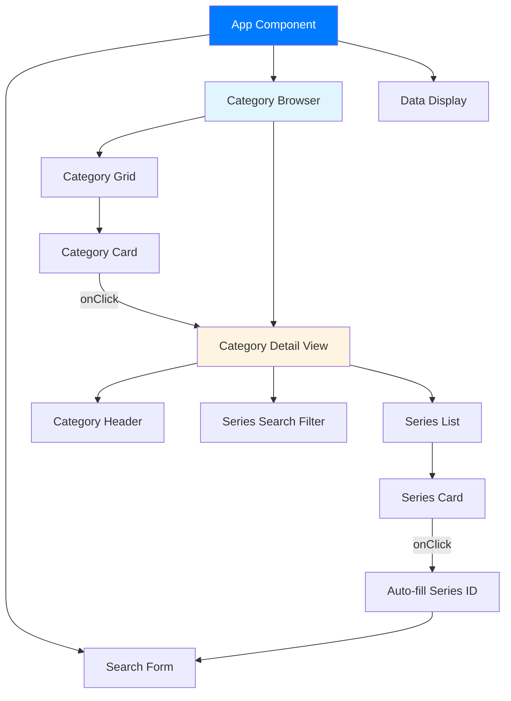
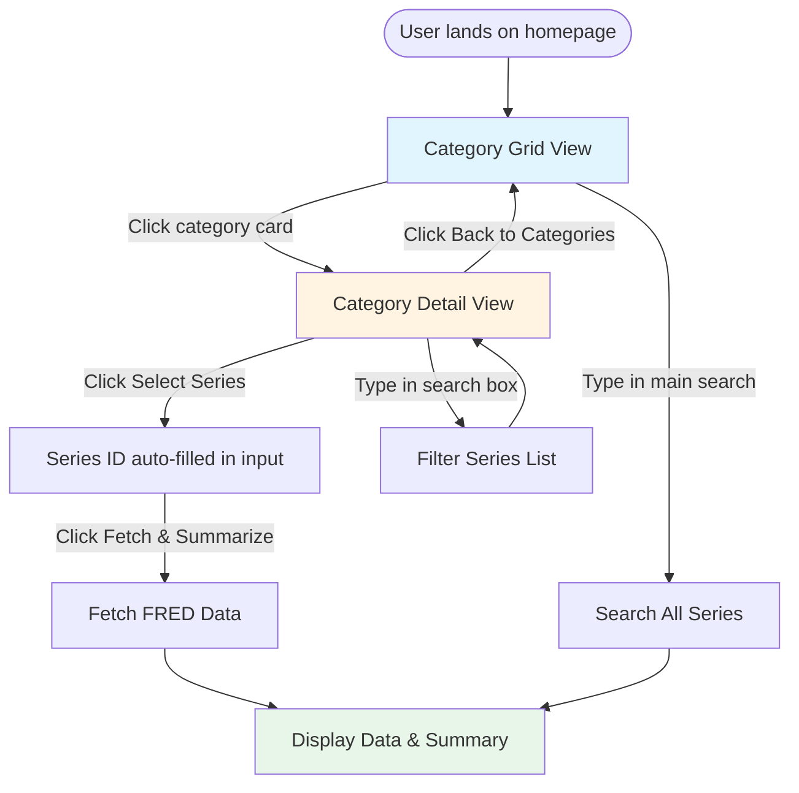

# Wireframe: Category-Based Browsing Feature

## Overview
This wireframe outlines the category-based browsing interface that allows users to discover FRED economic data series by browsing through organized categories instead of requiring knowledge of specific series IDs.

---

## Screen 1: Main View with Category Tabs

```
┌─────────────────────────────────────────────────────────────────┐
│                    Simple FRED Site                              │
│         Fetch and summarize economic data from FRED              │
├─────────────────────────────────────────────────────────────────┤
│                                                                   │
│  ┌─────────────────────────────────────────────────────────┐   │
│  │  FRED Series ID: [________________]  [Fetch & Summarize] │   │
│  └─────────────────────────────────────────────────────────┘   │
│                                                                   │
│  ┌─────────────────────────────────────────────────────────┐   │
│  │  Browse by Category                                      │   │
│  ├─────────────────────────────────────────────────────────┤   │
│  │                                                           │   │
│  │  [Employment] [Inflation] [GDP] [Interest Rates]         │   │
│  │  [Money & Banking] [Production] [Prices] [More...]       │   │
│  │                                                           │   │
│  │  ┌──────────────┐  ┌──────────────┐  ┌──────────────┐  │   │
│  │  │ 📊           │  │ 📊           │  │ 📊           │  │   │
│  │  │ Employment   │  │ Inflation    │  │ GDP &        │  │   │
│  │  │              │  │              │  │ Components   │  │   │
│  │  │ 45 series    │  │ 32 series    │  │ 28 series    │  │   │
│  │  └──────────────┘  └──────────────┘  └──────────────┘  │   │
│  │                                                           │   │
│  │  ┌──────────────┐  ┌──────────────┐  ┌──────────────┐  │   │
│  │  │ 📊           │  │ 📊           │  │ 📊           │  │   │
│  │  │ Interest     │  │ Money &      │  │ Production   │  │   │
│  │  │ Rates       │  │ Banking      │  │ & Business   │  │   │
│  │  │              │  │              │  │ Activity     │  │   │
│  │  │ 38 series    │  │ 42 series    │  │ 35 series    │  │   │
│  │  └──────────────┘  └──────────────┘  └──────────────┘  │   │
│  │                                                           │   │
│  └─────────────────────────────────────────────────────────┘   │
│                                                                   │
└─────────────────────────────────────────────────────────────────┘
```

### Key Elements:
- **Category Cards**: Visual cards with icons, category name, and series count
- **Grid Layout**: 3-column responsive grid (2 columns on tablet, 1 on mobile)
- **Hover State**: Cards highlight on hover with subtle shadow/elevation
- **Click Action**: Clicking a category card expands to show series list

---

## Screen 2: Category Detail View (Expanded)

```
┌─────────────────────────────────────────────────────────────────┐
│                    Simple FRED Site                              │
│         Fetch and summarize economic data from FRED              │
├─────────────────────────────────────────────────────────────────┤
│                                                                   │
│  ┌─────────────────────────────────────────────────────────┐   │
│  │  FRED Series ID: [________________]  [Fetch & Summarize] │   │
│  └─────────────────────────────────────────────────────────┘   │
│                                                                   │
│  ┌─────────────────────────────────────────────────────────┐   │
│  │  ← Back to Categories    Employment (45 series)          │   │
│  ├─────────────────────────────────────────────────────────┤   │
│  │                                                           │   │
│  │  [Search in category...]                                 │   │
│  │                                                           │   │
│  │  ┌───────────────────────────────────────────────────┐   │   │
│  │  │ 📈 Unemployment Rate (UNRATE)                      │   │   │
│  │  │ Monthly | Seasonally Adjusted | Percent           │   │   │
│  │  │ [Select Series]                                    │   │   │
│  │  └───────────────────────────────────────────────────┘   │   │
│  │                                                           │   │
│  │  ┌───────────────────────────────────────────────────┐   │   │
│  │  │ 📈 Nonfarm Payroll Employment (PAYEMS)            │   │   │
│  │  │ Monthly | Seasonally Adjusted | Thousands         │   │   │
│  │  │ [Select Series]                                    │   │   │
│  │  └───────────────────────────────────────────────────┘   │   │
│  │                                                           │   │
│  │  ┌───────────────────────────────────────────────────┐   │   │
│  │  │ 📈 Labor Force Participation Rate (CIVPART)       │   │   │
│  │  │ Monthly | Seasonally Adjusted | Percent           │   │   │
│  │  │ [Select Series]                                    │   │   │
│  │  └───────────────────────────────────────────────────┘   │   │
│  │                                                           │   │
│  │  ... (showing 10 of 45, [Load More])                    │   │
│  │                                                           │   │
│  └─────────────────────────────────────────────────────────┘   │
│                                                                   │
└─────────────────────────────────────────────────────────────────┘
```

### Key Elements:
- **Breadcrumb Navigation**: "← Back to Categories" link at top
- **Category Header**: Shows category name and total series count
- **Search Filter**: Optional search box to filter series within category
- **Series Cards**: Each series shows:
  - Icon (📈 for time series)
  - Full title
  - Series ID (in parentheses)
  - Metadata: Frequency, Seasonal Adjustment, Units
  - "Select Series" button
- **Pagination**: "Load More" or pagination controls for large lists

---

## Screen 3: Mobile/Responsive View

```
┌─────────────────────────────┐
│   Simple FRED Site          │
│   Fetch and summarize...    │
├─────────────────────────────┤
│                             │
│  [FRED Series ID: _____]    │
│  [Fetch & Summarize]        │
│                             │
│  Browse by Category         │
│  ─────────────────────      │
│                             │
│  ┌─────────────────────┐   │
│  │ 📊 Employment       │   │
│  │ 45 series           │   │
│  └─────────────────────┘   │
│                             │
│  ┌─────────────────────┐   │
│  │ 📊 Inflation        │   │
│  │ 32 series           │   │
│  └─────────────────────┘   │
│                             │
│  ┌─────────────────────┐   │
│  │ 📊 GDP & Components │   │
│  │ 28 series           │   │
│  └─────────────────────┘   │
│                             │
│  [View All Categories ▼]   │
│                             │
└─────────────────────────────┘
```

### Key Elements:
- **Single Column Layout**: Stacked category cards
- **Collapsible Categories**: "View All Categories" expandable section
- **Touch-Friendly**: Larger tap targets (minimum 44x44px)
- **Simplified Cards**: Reduced information density

---

## Component Structure



---

## Component Breakdown

### 1. Category Card Component
```
┌──────────────────────┐
│   [Icon]             │
│   Category Name      │
│   X series           │
└──────────────────────┘
```

**States:**
- Default: Subtle border, light background
- Hover: Elevated shadow, border highlight
- Active/Selected: Blue border, highlighted background

**Dimensions:**
- Desktop: ~250px width, ~150px height
- Tablet: ~200px width, ~140px height
- Mobile: Full width, ~120px height

---

### 2. Series Card Component
```
┌────────────────────────────────────────────┐
│ [Icon] Series Title (SERIES_ID)            │
│ Frequency | Adjustment | Units             │
│ [Select Series]                            │
└────────────────────────────────────────────┘
```

**Information Hierarchy:**
1. Title (largest, bold)
2. Series ID (smaller, gray, in parentheses)
3. Metadata (smallest, gray, separated by pipes)
4. Action button (prominent, right-aligned)

---

## User Flow Diagram

### ASCII Flow:
```
┌─────────────┐
│  Home Page  │
│  (Categories│
│   Grid)     │
└──────┬──────┘
       │
       │ User clicks category
       ▼
┌─────────────────┐
│ Category Detail │
│ (Series List)   │
└──────┬──────────┘
       │
       ├─→ User clicks "Select Series"
       │   └─→ Series ID auto-filled
       │       └─→ User clicks "Fetch & Summarize"
       │
       ├─→ User clicks "Back to Categories"
       │   └─→ Returns to category grid
       │
       └─→ User searches within category
           └─→ Filtered series list
```

### Interactive Flow Diagram:



---

## Interaction States

### Category Card States:
1. **Default**: 
   - Background: rgba(255, 255, 255, 0.05)
   - Border: 1px solid rgba(255, 255, 255, 0.1)
   - Cursor: pointer

2. **Hover**:
   - Background: rgba(255, 255, 255, 0.08)
   - Border: 1px solid #007bff
   - Box-shadow: 0 4px 8px rgba(0, 0, 0, 0.1)
   - Transform: translateY(-2px)

3. **Active/Clicked**:
   - Background: rgba(0, 123, 255, 0.1)
   - Border: 2px solid #007bff

### Series Card States:
1. **Default**: Similar to category card
2. **Hover**: Highlight with blue accent
3. **Selected**: Blue background tint, checkmark icon

---

## Data Structure

### Category Object:
```javascript
{
  id: "employment",
  name: "Employment",
  icon: "📊",
  description: "Labor market indicators",
  seriesCount: 45,
  series: [
    {
      id: "UNRATE",
      title: "Unemployment Rate",
      frequency: "Monthly",
      seasonalAdjustment: "Seasonally Adjusted",
      units: "Percent"
    },
    // ... more series
  ]
}
```

---

## Responsive Breakpoints

- **Desktop** (> 1024px): 3-column grid
- **Tablet** (768px - 1024px): 2-column grid
- **Mobile** (< 768px): 1-column stack

---

## Accessibility Considerations

1. **Keyboard Navigation**: 
   - Tab through categories
   - Enter/Space to select
   - Arrow keys to navigate within category

2. **Screen Readers**:
   - ARIA labels: "Category: Employment, 45 series available"
   - Role attributes: `role="button"` for clickable cards
   - Live regions for dynamic content updates

3. **Focus Indicators**:
   - Visible focus outline on keyboard navigation
   - High contrast focus states

---

## Visual Design Notes

- **Icons**: Use consistent icon set (e.g., Font Awesome, Material Icons)
- **Colors**: Match existing app theme (#007bff primary color)
- **Typography**: 
  - Category names: 1.2rem, bold
  - Series titles: 1rem, semi-bold
  - Metadata: 0.875rem, regular, gray
- **Spacing**: 
  - Card padding: 1.5rem
  - Grid gap: 1.5rem
  - Section margin: 2rem

---

## Implementation Notes

1. **State Management**:
   - `selectedCategory`: Currently selected category ID
   - `categories`: Array of category objects
   - `filteredSeries`: Series list for current category (with search filter)

2. **API Integration**:
   - Fetch categories from backend or use static curated list
   - Fetch series for category on demand
   - Cache category data to reduce API calls

3. **Performance**:
   - Lazy load series when category is expanded
   - Virtual scrolling for categories with many series
   - Debounce search input

---

## Alternative Layout: Sidebar Navigation

```
┌─────────────────────────────────────────────────────┐
│  Simple FRED Site                                    │
├──────────┬──────────────────────────────────────────┤
│          │  FRED Series ID: [____] [Fetch]          │
│ Category │                                          │
│ List     │  ┌──────────────────────────────────┐   │
│          │  │ Selected Series:                 │   │
│ • Employ │  │ Unemployment Rate (UNRATE)        │   │
│ • Inflat │  │                                  │   │
│ • GDP    │  │ [Series details and data...]      │   │
│ • Intere │  │                                  │   │
│ • Money  │  └──────────────────────────────────┘   │
│          │                                          │
│          │  [Series list for selected category]     │
│          │                                          │
└──────────┴──────────────────────────────────────────┘
```

This alternative uses a persistent sidebar for category navigation, keeping the main content area for series selection and data display.

